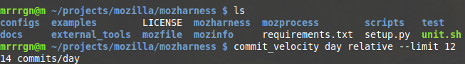

commit_velocity
===============

####About

A handy bash function that calculates the velocity of any mercurial or git 
repository. Velocity may be relative or absolute, meaning, calculated
against the current timestamp or against the most recent commit.

####Install

Since this is a bash function you should source the file:

manually: ``source commit_velocity.sh``

bash_profile: ``echo ". source `pwd`/commit_velocity.sh" >> ~/.bash_profile``

####Usage

  ``commit_velocity <min|hr|day|week|month> <relative|absolute> [ hg|git log ...]``

Because all non-positional arguments are passed directly to hg|git log, it's easy
to take the velocity for specific files, authors, date ranges, or numbers of commits.

i.e. to see the velocity of the file somefile.c:

  ``commit_velocity day relative path/to/somefile.c``
